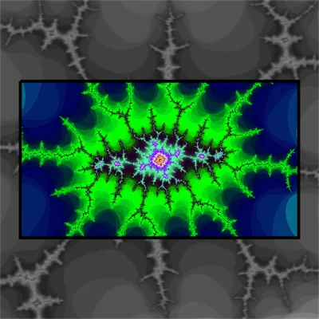

<a href="https://rockingship.github.io/jsFractalZoom/jsFractalZoom.html?x=-0.8665722560433728&y=0.2308933773688535&r=3.021785750590329e-7&a=0&density=0.0362&iter=10080&theme=6&seed=2140484823" target="_blank"></a>

# Welcome to the wonderful world of (fractal) zooming.

When insufficient resources force you to prioritize which pixels to render first...

This project has 3 Components:

- [XaoS](http://xaos.sourceforge.net/black/index.php) inspired fractals as sample content.
- The `zoomer` engine.
- The `splash` video codec.

The only requirement is the implementation of:

```
    /**
     * This is done for every pixel. optimize well!
     * Easy extendable for 3D.
     * Return the pixel value for the given floating point coordinate.
     * Zoomer will use it to fill integer pixel positions. 
     * The positions are ordered in decreasing significance.
     *
     * @param {Zoomer}      zoomer  - 😊
     * @param {ZoomerFrame} frame   - Pixels/Palette/Rotate
     * @param {float}       x       - X coordinate
     * @param {float}       y       - Y coordinate
     * @return {int} - Pixel value           
     */
    onUpdatePixel: (zoomer, frame, x, y) => {
        return <YourCodeHere>;
    }
```

## NOTE: This document is under construction and semantically/grammatically under-par!

Currently collecting points of interest, later redacting a storyline.

## Experience the fractal zoomer

Click on the image above to start the zoomer at the presented location.  
Or, start vanilla [https://rockingship.github.io/jsFractalZoom/jsFractalZoom.html](https://rockingship.github.io/jsFractalZoom/jsFractalZoom.html)

Suggestions for the best experience:
- Enable full-screen. If the browser gives too much of a hassle, there is a button in the top right corner.
- Fly around in high speed to nice places.
- Too much noise, with the wheel you can adjust focus like a microscope.
- Drag to position photogenic.
- Staying put enables turbo mode for maximum calculations.
- Rendering is complete when "complete" (top status line in menu) reaches "1".
- Menu has many goodies. The control panel can be resized.
- Panel buttons "save" to save PNG or "url" to copy weblink to clipboard.

Saving:
- Files are PNG.
- Panels and text are removed.
- PNG contains navigation and setting.
- Drop PNG on zoomer page to load stored information.

Tips for 4K:
- Switch to HD resolution for fast navigation
- For scenic locations switch to 4K for maximum quality

For desktop (primary design target):
- Use `ctrl+` / `ctrl-` to change display resolution. For highest quality match this to your screen.
- Mouse left: zoom in
- Mouse right: zoom out
- Wheel pressed: drag
- Wheel turn: focus

Touch screen:
- Hold horizontal if buttons are too small.
- Disable rotation for a performance boost.
- 1-finger: drag
- 2-fingers: navigation. You can release one finger afterwards.
- 3-fingers: focus. You can release two fingers. Then with your second finger use the screen like it being a wheel.

Multi-monitor wallpapers:
- Find location to your liking.
- Press "URL" to copy settings to clipboard
- Paste clipboard in URL bar and append `&w=<width>&h=<height>` reflecting your total multi-monitor size.
- Resize window to minimize margins.
- Reload adapted URL to adjust internals accordingly.
- Wait for complete to reach "1".
- "SAVE".

### A Pixel is not a Pixel

The CSS standard has sadly botched the meaning of DPI by fixating it to being 96.  
To make matters worse, browser builders botched it further (especially on mobile) by differentiating between CSS and Physical pixels.  
Even the latter is not always what it seems.

The fractal zoomer displays a popup when it detects screen resolution changes.  
For maximum quality the resolution should match that of your display.

On desktop, you can change the resolution with `ctrl+` and `ctrl-`.  
Mobile sets CSS pixels which could be as low as 560x360, this to save battery.  
To switch to physical pixels, toggle the `HiRes` button on the control panel.

For more information, visit the side project: [https://github.com/xyzzy/realDPI](https://github.com/xyzzy/realDPI)

## The `zoomer` architecture

The `zoomer` engine lets you visually navigate through a procedurally generated landscape.  
It assumes that calculating pixel value is highly expensive.  
Maximises reuse of data from the previous frame to avoid unnecessary calculations,  
New pixel values are calculated in order of significance.

###  Navigation

The directional viewing vector consists of three components:

  - The x,y coordinates, extendable to 3D or more
  - radius
  - rotational angle

Updating the directional vector is user defined.

### States

`zoomer` is a timed state machine to construct frames.

The states are:

  - `COPY`
    Construct rulers for scaling/shifting pixels from previous frame.  
    Copy pixels using an `indexed memcpy()`.  
    Determine calculate order for rows/columns.

  - `UPDATE`
    Update key pixels along an axis, called a scanline.  
    Key pixels are pixels that have been scanned along in all directions.  
    Flood fill neighbours to create motion blur using `interleaved memcpy()`.

  - `RENDER`
    Copy pixel values from the backing store to a RGBA storage.  
    Optional palettes are applied.  
    Apply rotation where/when necessary using `angled memcpy()`.

  - `PAINT`
    Write RGBA storage to the display.  
    Most probably being a canvas using `putImageData()`.

###  Phased Locked Loop

The time needed for `COPY`, `RENDER` and `PAINT` is constant.  
The `UPDATE` timings for calculating a pixel is undetermined.  
Duration and overhead of time measurement functions is considered a factor more than calculating pixel values.
The stability of framerate depends on the accuracy of timing predictions.

Phased Locked Loop predicts the number of calculations/iterations based on averages from the past.  
Two time measurements are made, before and after a predetermined number of iterations.  
The number of iterations for the next round is adjusted heuristically.

Phase Lock Loop is self adapting to environmental changes like Javascript Engine, CPU and display.

### Coordinates

Pixel values use three different types of coordinates:

  - x,y (float) formula coordinate
  - u,v (int) screen position
  - i,j (int) backing store location

Which unit is applicable depends on the position in the data path:

formula `<-xy->` backingStore `<-ij->` clip/rotation `<-uv->` screen/canvas

### Backing store

Backing store has three functions:

  - Separation of storage/logic
    Pixel data objects (frames) can easily transfer to web-workers or other distributed agent.

  - Contains the previous frame
    Ruler construction requires scoring based on frame differences.
    Scoring is currently the amount of pixel drift, and can be adapted to different models.

  - Holds inter-frame
    Updating scanlines can fill neighbouring pixels.  
    Encoders/Decoders share temporal synced pixel data

### Rotation



When rotating is enabled the pixel storage (backing store) needs to hold all the pixels for all angles.  
The size of the storage is the diagonal of the screen/canvas squared.  
Rotation uses fixed point sin/cos.  
The sin/cos can be loop unrolled to make clipping/rotating high speed.

Rotation requires square backing store, otherwise it is shrink-to-fit width*height.

Rotation has two penalties:
 - Needs to calculate about 2.5 times more pixels than displayed
 - Extra loop overhead

`Zoomer` can easily enable/disable rotational mode on demand.

### `memcpy()`

Javascript as a language does not support acceleration of array copy.  
In languages like `C`/`C++`, it is advertised as library function `memcpy()`.  
With Javascript, the only access to `memcpy()` is through `Array.subarray`

```
    /**
     * zoomerMemcpy Accelerated array copy.
     *
     * @param {ArrayBuffer} dst       - Destination array
     * @param {int}         dstOffset - Starting offset in destination
     * @param {ArrayBuffer} src       - Source array
     * @param {int}         srcOffset - Starting offset in source
     * @param {int}         length    - Number of elements to be copyied
     */
    function zoomerMemcpy(dst, dstOffset, src, srcOffset, length) {
        src = src.subarray(srcOffset, srcOffset + length);
        dst.set(src, dstOffset);
    }
```

Within `zoomer`, three variations of `memcpy()` are used:

#### Indexed

Indexed `memcpy` transforms the contents using a lookup table.  
Palettes are lookup tables translating from pixel value to RGBA.  
Copying/scaling/shifting pixel values from previous frame to next after ruler creation.

A conceptual implementation:
```
    function memcpy_indexed(dst, src, cnt) {
      while (--cnt >= 0)
        *dst++ = LUtable[*src++];
    }  
```

#### Interleaved

There are two kinds of scan-lines: scan-rows and scan-columns.  
Only scan-rows can profit from hardware acceleration.  
CPU instruction-set lacks multi dimensional support.  
Auto-increment is always word based.  
Acceleration support for arbitrary offset is missing.

A conceptual implementation:
```
    // increment can be negative
    // an option could be to have separate increments for source/destination
    function memcpy_interleave(dst, src, cnt, increment) {
      offset = 0;
      while (--cnt >= 0) {
          dst[offset] = SomeLookupTable[src[offset]];
          offset += increment;
        }
    }  
```

#### Angled

Clip and rotate when copying pixels from the backing store to RGBA

A conceptual implementation:
```
    /**
     * memcpy with clip and rotate. (partially optimised)
     *
     * @param {ArrayBuffer} dst         - Destination array (rgba[]) 
     * @param {ArrayBuffer} src         - Source array (pixel[])
     * @param {int}         viewWidth   - Viewport width (pixels)
     * @param {int}         viewHeight  - Viewport height (pixels)
     * @param {int}         pixelWidth  - Backing store width (pixels)
     * @param {int}         pixelHeight - Backing store height (pixels)
     */
    function memcpyAngle(dst, src, angle, viewWidth, viewHeight, pixelWidth, pixelHeight) {
		// Loop unroll slating increments
		// Fixed point floats
		// with 4K displays rounding errors are negligible. 
		const rsin = Math.sin(angle * Math.PI / 180); // sine for view angle
		const rcos = Math.cos(angle * Math.PI / 180); // cosine for view angle
		const xstart = Math.floor((pixelWidth - viewHeight * rsin - viewWidth * rcos) * 32768);
		const ystart = Math.floor((pixelHeight - viewHeight * rcos + viewWidth * rsin) * 32768);
		const xstep = Math.floor(rcos * 65536);
		const ystep = Math.floor(rsin * 65536);

		// copy pixels
		let vu = 0;
        for (let j = 0, x = xstart, y = ystart; j < viewHeight; j++, x += xstep, y += ystep) {
            for (let i = 0, ix = x, iy = y; i < viewWidth; i++, ix += ystep, iy -= xstep) {
                dst[vu++] = src[(iy >> 16) * pixelWidth + (ix >> 16)];
            }
        }
    }
```

# The `zoomer` architecture

# The `zoomer` API

Zoomer is full-screen canvas orientated.  
All interaction with the physical environment (DOM) is done through callbacks.  
Coordinates are floating point, pixel locations are integer.  
Scaling those two is a design fundamental.  
Rotation is also fully integrated with a minimal performance penalty.  
`devicePixelDensity` is a natural environment and integrates seamlessly.

Being full-screen oriented, HTML positioning is absolute.  
CSS for centering and padding the canvas.  
Javascript to glue resources.

The following template is a bare minimum:

```
<!DOCTYPE html>
<html lang="en">
<head>
    <title>Example</title>
    <meta charset="UTF-8">
    <style>
        body {
            position: absolute;
            border: none;
            margin: auto;
            padding: 0;
            height: 100%;
            width: 100%;
            top: 0;
            right: 0;
            bottom: 0;
            left: 0;
        }
        #idZoomer {
            position: absolute;
            border: none;
            margin: auto;
            padding: 0;
            width: 100%;
            height: 100%;
            top: 0;
            right: 0;
            bottom: 0;
            left: 0;
        }
    </style>
    <script type="text/javascript" src="zoomer.js"></script>
</head>
<body>
<canvas id="idZoomer"> </canvas>
<script type="text/javascript">
    "use strict";

    window.addEventListener("load", function () {

        /**
         * Get canvas to draw on (mandatory)
         * @type {HTMLElement}
         */
        const domZoomer = document.getElementById("idZoomer");

        /**
         * Get context 2D (mandatory), "desynchronized" is faster but may glitch hovering mouse (optional)
         * @type {CanvasRenderingContext2D}
         */
        const ctx = domZoomer.getContext("2d", {desynchronized: true});

        // get available client area
        const realWidth = Math.round(document.body.clientWidth * window.pixelDensityRatio);
        const realHeight = Math.round(document.body.clientHeight * window.pixelDensityRatio);

        // set canvas size (mandatory)		
        domZoomer.width = realWidth;
        domZoomer.height = realHeight;

        /**
         * Create zoomer (mandatory)
         * @type {Zoomer}
         */
        const zoomer = new Zoomer(realWidth, realHeight, false, OPTIONS);

        /**
         * Create a small key frame (mandatory)
         * @type {ZoomerView}
         */
        const keyView = new ZoomerView(64, 64, 64, 64);

        // Calculate all the pixels (optional), or choose any other content 
        keyView.fill(initialX, initialY, initialRadius, initialAngle, zoomer, zoomer.onUpdatePixel);

        // set initial position and inject key frame (mandatory)
        zoomer.setPosition(initialX, initialY, initialRadius, initialAngle, keyView);

        // start engine (mandatory)
        zoomer.start();
    });
</script>
</body>
</html>
```

The only mandatory addition is the contents of `OPTIONS` which are initial values for any or all `zoomer` properties.

All callbacks have the zoomer instance as first argument for easy engine access.  
In combination with arrow functions, `this` is caller/DOM namespace and `zoomer` is engine/webworker namespace.

Most important properties are:

```
const OPTIONS = {
    /**
     * Frames per second.
     * Rendering frames is expensive, too high setting might render more than calculate.
     * If a too high setting causes a frame to drop, `zoomer` will lower this setting with 10%
     *
     * @member {float} - Frames per second
     */
    frameRate: 20,

    /**
     * Disable web-workers.
     * Offload frame rendering to web-workers.
     * When ever the default changes, you will appreciate it explicitly being noted.
     * You cannot use webworkers if you add protected recources to frames.
     *
     * @member {boolean} - disable/Enable web workers.
     */
    disableWW: false,

    /**
     * Additional resources added to new frames.
     * Frames are passed to webworkers.
     * Frames are re-used without reinitialising.
     *
     * Most commonly, setup optional palette,
     *
     * @param {Zoomer}      zoomer - Running engine
     * @param {ZoomerFrame} frame  - Frame being initialized.
     */
    onInitFrame: (zoomer, frame) => {
        // allocate RGBA palette.

        /* frame.palette = new Uint32Array(65536); */
    },

    /**
     * Start of a new frame.
     * Process timed updates (piloting), set x,y,radius,angle.
     *
     * @param {Zoomer}      zoomer    - Running engine
     * @param {ZoomerView}  calcView  - View about to be constructed
     * @param {ZoomerFrame} calcFrame - Frame about to be constructed
     * @param {ZoomerView}  dispView  - View to extract rulers
     * @param {ZoomerFrame} dispFrame - Frame to extract pixels
     */
    onBeginFrame: (zoomer, calcView, calcFrame, dispView, dispFrame) => {
        // set navigation direction
        
        /* zoomer.setPosition(centerX, centerY, radius, angle); */
    },

   /**
     * This is done for every pixel. optimize well!
     * Easy extendable for 3D.
     * Return the pixel value for the given floating point coordinate.
     * Zoomer will use it to fill integer pixel positions. 
     * The positions are ordered in decreasing significance.
     *
     * @param {Zoomer}      zoomer  - Running engine
     * @param {ZoomerFrame} frame   - Pixel/Palette/Rotate
     * @param {float}       x       - X coordinate
     * @param {float}       y       - Y coordinate
     * @return {int} - Pixel value           
     */
    onUpdatePixel: (zoomer, frame, x, y) => {
        // calculate pixel
        
        return 0; /* your code here */
    },

    /**
     * Start extracting (rotated) RGBA values from (paletted) pixels.
     * Extract rotated view from pixels and store them in specified imagedata.
     * Called just before submitting the frame to a web-worker.
     *
     * @param {Zoomer}      zoomer - Running engine
     * @param {ZoomerFrame} frame  - Frame about to render
     */
    onRenderFrame: (zoomer, frame) => {
        // update palette
        
        /* updatePalette(frame.palette); */
    },

    /**
     * Frame construction complete. Update statistics. Check resize.
     *
     * @param {Zoomer}      zoomer - Running engine
     * @param {ZoomerFrame} frame  - Frame before releasing to pool
     */
    onEndFrame: (zoomer, frame) => {
        // statistics
        
        /* console.log('fps', zoomer.avgFrameRate); */
    },

    /**
     * Inject frame into canvas.
     * This is a callback to keep all canvas resource handling/passing out of Zoomer context.
     *
     * @param {Zoomer}      zoomer - Running engine
     * @param {ZoomerFrame} frame  - Frame to inject
     */
    onPutImageData: (zoomer, frame) => {
        // get final buffer
        const imageData = new ImageData(new Uint8ClampedArray(frame.rgba.buffer), frame.viewWidth, frame.viewHeight);

        // draw frame onto canvas. `ctx` is namespace of caller.
        ctx.putImageData(imagedata, 0, 0);
    },

}
```

## Function declaration

There are two styles of function declaration, traditional and arrow notation.  
Both are identical in functionality and performance.  
Difference is the binding of `this`.  
With `function()` the bind is the web-worker event queue, with `() => { }` the bind is the DOM event queue.

```
  (a,b,c) => { }       - Strongly advised
  function(a,b,c) { }  - Expert mode
```

# Background

`jsFractalZoom` is an fractal generator/zoomer written in javascript. It was inspired by XaoS, [https://xaos.sourceforge.net/black/index.php](https://xaos.sourceforge.net/black/index.php).

The project was originally created in May 2011, resurrected in 2018 and extended in 2020.

The 2020 version is canvas based. The 2018 engine created GIF images using an ultra fast GIF encoder [https://github.com/xyzzy/jsGifEncoder](https://github.com/xyzzy/jsGifEncoder).
 
## Demos

There are 3 demos. All are work-in-progress and may not work in any/all situations.

[jsFractalZoom-formula.html](https://rockingship.github.io/jsFractalZoom/jsFractalZoom-formula.html)
The original with most of the formula's working.

[jsFractalZoom-navigation.html](https://rockingship.github.io/jsFractalZoom/jsFractalZoom-navigation.html)
The original with most of the navigation working.

[jsFractalZoom.html](https://rockingship.github.io/jsFractalZoom/jsFractalZoom.html)
The current unification and completion.

## Versioning

This project adheres to [Semantic Versioning](http://semver.org/spec/v2.0.0.html).
For the versions available, see the [tags on this repository](https://github.com/xyzzy/jsFractalZoom/tags).

## License

This project is licensed under Affero GPLv3 - see the [LICENSE](LICENSE) file for details.

## Acknowledgments

* All the inspiration from the XaoS project.
