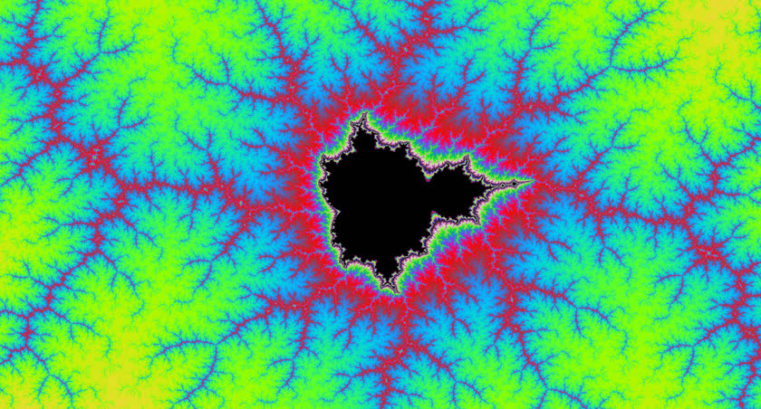
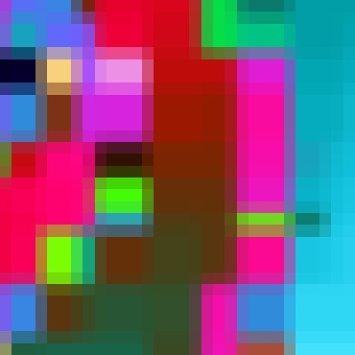
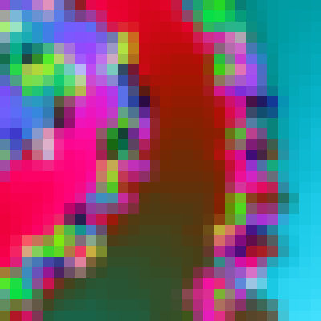
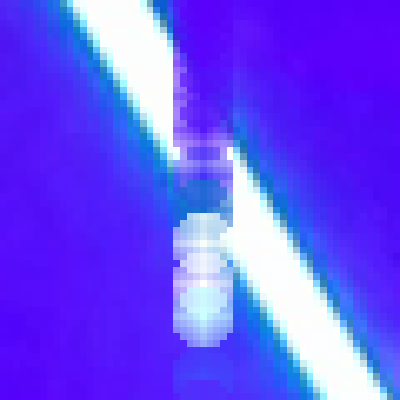
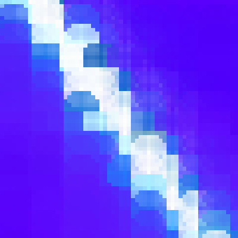

\[click on image to start `zoomer` at shown location\]  
[](https://rockingship.github.io/jsFractalZoom?x=-0.8665722560433728&y=0.2308933773688535&r=3.021785750590329e-7&a=0&density=0.0362&iter=10080&theme=6&seed=2140484823)

# `jsFractalZoom`

### Welcome to the Wonderful World of (fractal) zooming and splash codec

*when insufficient resources force you to prioritize which pixels to render first*

This project has 3 main Components:

  - The `zoomer` engine.  
    Or skip to the location [120 lines below](#the-fractal-zoomer)

  - [XaoS](https://github.com/xaos-project) inspired fractals as sample content.  
    Visit the [gallery](https://rockingship.github.io/jsFractalZoom-media/gallery) or jump on the [engine](https://rockingship.github.io/jsFractalZoom)
    
  - The `splash` video codec.  
    Or skip to the location [760 lines below](#the-splash-codec)

Implementation wise, the only requirement is to supply:

```javascript
    /**
     * This is done for every pixel. optimize well!
     * Easy extendable for 3D.
     * Return the pixel value for the given floating point coordinate.
     * Zoomer will use it to fill integer pixel positions. 
     * The positions are ordered in decreasing significance.
     *
     * @param {Zoomer}      zoomer  - 😊
     * @param {ZoomerFrame} frame   - Pixels/Palette/Rotate
     * @param {float}       x       - X coordinate
     * @param {float}       y       - Y coordinate
     * @return {int} - Pixel value           
     */
    onUpdatePixel: (zoomer, frame, x, y) => {
        [YourCodeHere];
    }
```

## Experience the fractal zoomer

Jump to [https://rockingship.github.io/jsFractalZoom](https://rockingship.github.io/jsFractalZoom)

How to use:
  - press the enlarge button in the top right (or F11) to enable full-screen.
  - fly around in high speed to nice places.
  - adjust the "density" using the mouse-wheel to help focus.
  - drag the image by holding down the mouse-wheel to a photogenic position.
  - staying static allows for faster loading speed.
  - the loading is "complete"  when the "complete" indicator reached "1" (located in the top bar).
  - the control panel can be resized using the bottom left resize button.

Saving:
  - saves as a PNG file.
  - the panels and text will be removed in the image.
  - the navigation and setting from capture are stored in the PNG file.
  - drop the PNG on the zoomer page to load the stored information.

Saving a multi-monitor desktop wallpaper:
  - find nice location
  - press "URL" to copy setting
  - paste in URL bar and add `&w=<width>&h=<height>` at the end. Replace `<width>` and `<height>` with your total multi-monitor dimensions.
  - load new URL
  - wait until "complete" reaches 1
  - save
  - enjoy your new wallpaper!

Tips for using in 4K:
  - switch to the HD (1080p) browser resolution for faster navigation.
  - switch to 4K for maximum quality.

For desktop use (primary design target):
  - use "ctrl+" /"ctrl-" to chang display resolution. For highest quality match resolution to your screen.
  - left mouse button: zoom in
  - right mouse button: zoom out
  - press mouse wheel to drag
  - turn mouse wheel to focus (adjusts "density" setting)

For touchscreen use:
  - enable full-screen mode, hold phone horizontally if buttons are too small.
  - can be used both portrait and landscape mode.
  - disable rotate in the zoomer menu for better performance.
  - use 1 finger to drag.
  - use 2 fingers to zoom: stretch to zoom in, pinch to zoom out.
    For unobstructed viewing while zooming you can release 1 finger.
  - use 3 finger to focus: release one finger and pinch or stretch with the remaining two to adjust "density".


## Table of contents

  - [Welcome to the Wonderful World of (fractal](#welcome-to-the-wonderful-world-of-fractal-zooming-and-splash-codec)
  - [Experience the fractal zoomer](#experience-the-fractal-zoomer)
  - [The fractal `zoomer`](#the-fractal-zoomer)
    - [Rulers](#rulers)
    - [Coordinates](#coordinates)
    - [Directional vector](#directional-vector)
    - [States](#states)
    - [Phased Locked Loop](#phased-locked-loop)
    - [Backing store](#backing-store)
    - [Rotation](#rotation)
    - [`memcpy()`](#memcpy)
      - [Indexed](#indexed)
      - [Interleaved](#interleaved)
      - [Angled](#angled)
    - [Application components](#application-components)
      - [Sample/skeleton implementation HTML/CSS](#sampleskeleton-implementation-htmlcss)
      - [Sample/skeleton implementation Javascript](#sampleskeleton-implementation-javascript)
      - [Function declaration](#function-declaration)
  - [The `splash` codec](#the-splash-codec)  
    - [Frame buffer](#frame-buffer)
    - [Ruler metrics and scoring](#ruler-metrics-and-scoring)
    - [Interpolation](#interpolation)
      - [Opaque rectangle fill](#opaque-rectangle-fill)  
      - [Transparent splash fill](#transparent-splash-fill)  
    - [Demonstration](#demonstration)
      - [Demo: Amsterdam Dance Event (contains flashing white lights)](#demo-amsterdam-dance-event-contains-flashing-white-lights)
      - [Demo: GTA speeding (contains reckless driving)](#demo-gta-speeding-contains-reckless-driving)
    - [FFmpeg](#ffmpeg)
  - [History](#history)
  - [Manifest](#manifest)
  - [Source code](#source-code)
  - [Versioning](#versioning)
  - [License](#license)
  - [Acknowledgments](#acknowledgments)

## The fractal `zoomer`

`zoomer` is a rendering engine that paints pixels on demand.  
Pixels are repositioned/duplicated until they drift too far away while moving and are recalculated.  

Two sample implementations are included: an interactive fractal navigator and a non-interactive fractal viewer.  
It is also used to display transverse Mercator projection with the `ccbc` project.  

`zoomer` utilises a state machine using phase-locked-loops to construct frames.  
This means that frame construction is split into different steps where timing metrics predict how long each step takes.  
Timer predictions allows the event queue to maximize computations while the user interface stays responsive.  
Three coordinate systems are also used throughout construction.  

### Rulers

Rulers contain pixel metadata and are used to determine "hot"/"cold" regions with lots/less of changes.  
Hot regions which focus on action are calculated first which cools them down.
Cooler regions focus on quality.  
Rulers are created by comparing the last rendered frame with the next desired frame.  
The goal is to maximize the amount of hot pixels (representing significant scene changes) before the frame construction time limit expires.

Rulers are used to implement the following:

  - Metadata for pixel storage.  
    See below.  

  - Create lookup tables for `memcpy_indexed()`.  
    Every pixel of a new frame is inherited from the previous frame.  
    Rulers indicate the source location that are the best choice based on pixel drift.  
    Scaling/shifting allows dynamic and seamless changing of frame size.
    This makes it possible to have arbitrary sized key-frames.

  - Scan-line scoring and ordering.  
    Determines the sequence in which scan-rows/columns are processed.

Rulers contain the following information:

  - Exact coordinate.  
    The coordinates used to calculate the pixel value.  
    
  - Drifted coordinate.  
    Original coordinates of pixels in cooler areas that drift without being recalculated. 
    
  - Score.  
    The pixel with the highest score is calculated first.  
    The default value is the difference between exact/drifted coordinates.  
    
  - Source location within the previous frame.  
    New frames are initially populated with drifted pixels that are closest to their exact coordinates.  

There are rulers for every dimensional axis.  
Initial frame population performs scaling and shifting which introduces motion-blur.  
Scan-line calculations determines exact pixel values for coordinates which introduces sharpness.

NOTE: Determining the ordering of scan-lines is determined exclusive by ruler metrics and not pixels values.

### Coordinates

Pixel values use three different types of coordinates:

  - x,y (float) formula coordinate  
    These coordinates are used to access the data model.

  - i,j (int) backing store location  
    The index/position with the data arrays.

  - u,v (int) screen position  
    The position on the screen after backing store extraction and rotation.

Which unit is applicable depends on the position in the data path:

>formula `<-xy->` backingStore `<-ij->` clip/rotation `<-uv->` screen/canvas

### Directional vector

The directional vector is what you see and how you move.  
This is a different concept than the motion vector used for macro blocks.
Updating the vector is user-defined, the engine considers it read-only.  

The vector consists of three components:

  - The x,y coordinates.  
    The coordinate of the screen center pixel.
    The current implementation is 2D and is easy extendable to 3D.
    
  - Radius.  
    The radius resembles the imaginary circle that is fully visible.  
    For landscape this is the top/bottom height, for portrait the left/right width.
    
  - Angle.  
    The rotation with the screen center pixel as anchor. 

### States

`zoomer` is a timed state machine to construct frames.  
Frame construction has been split into phases/states.

The states are:

  - `COPY` (New frame)  
    Construct rulers for copying/scaling/shifting pixels from the previous frame.  
    Copy pixels using an `indexed memcpy()`.  
    Determine calculation order of rows/columns.

  - `UPDATE` (Calculate blurry pixels)  
    Update key pixels along an axis (row/column) called a scanline.  
    Key pixels are pixels that have been marked as scanned across all axis.  
    Flood fill neighbours to create motion blur using `interleaved memcpy()`.

  - `RENDER` (RGBA frame buffer)
    Copy pixel values from the backing store to an RGBA storage.  
    Optional colour palette is applied.  
    Apply rotation where/when necessary using `angled memcpy()`.

  - `PAINT` (Forward to display)
    Write RGBA storage to the display.  
    Most probably the display is a canvas and written to using `putImageData()`.  
    `putImageData()` can be CPU intensive and has therefore a dedicated state.

State timings:

The `COPY`, `UPDATE` and `PAINT` states are run from the main event queue, `RENDER` is done by web-workers.
The duration of a complete frame is `max(COPY+UPDATE+PAINT,RENDER)`.
The Phased Locked Loop should tune `COPY+UPDATE+PAINT` to equal the requested frame rate

Running on an AMD FX-8320E, state durations (mSec) have been grossly averaged in the following table:

|  platform       |   COPY  |  UPDATE  |  RENDER  |  PAINT  |  MAX FPS |
|:----------------|:-------:|:--------:|:--------:|:-------:|:--------:|
|  Firefox 1080p  |   7     |  30      |  11      |    9    | 21
|  Firefox 4K     |   50    |  30      |  150     |   62    |  7
|  Chrome 1080p   |   11    |  29      |  9       |    2    | 23
|  Chrome 4K      |   38    |  28      |  31      |   12    | 12

The timings were measured with a requested FPS of 20.  
The 4K is too much to handle, the engine will automatically reduce FPS until balance is reached.

The choice to perform `RENDER` as web-worker is because:

  - different timings during initial design because of different optimisations.  
  - The requirement for needing a previous frame for ruler calculations complicated parallel implementation.  

NOTE: `requestAnimationFrame` is basically unusable because (at least) Firefox has added jitter as anti-fingerprinting feature.  
It also turns out that a stable interval between frames is more important than the moment they are displayed. 

### Phased Locked Loop

The computation time needed for `COPY`, `RENDER` and `PAINT` is constant depending on screen resolution.  
The `UPDATE` timings for calculating a pixel is variable and undetermined.  
Querying timers is considered a performance hit and should be avoided, especially after calculating each pixel.  
The stability of framerate depends on the accuracy of timing predictions.

Phased Locked Loop predicts the number of calculations/iterations based on averages from the past.  
Two time measurements are made, before and after a predetermined number of iterations.  
The number of iterations for the next round is adjusted accordingly.

Phased Lock Loops are self adapting to environmental changes like Javascript engine, hardware and display resolutions.  

### Backing store

Backing store (data storage) has three functions:

  - Separation of storage/logic.
    `zoomer` separates data (frames) and code (views) to simplify (and optimise) data transfer from/to web-workers.  
    Rulers are part of views and web-workers are part of frames.
    
  - Contains the previous frame.  
    Ruler construction requires scoring based on frame differences.  
    Scoring is currently the amount of pixel drift. It can be adapted to different models.

  - Rotation.  
    Holds the out-of-sight pixel when rotating with a rectangular viewport.

### Rotation

[rotate-400x400.webp](assets/rotate-400x400.webp)

When rotating is enabled the pixel storage (backing store) needs to hold all the pixels for all angles.  
The size of the storage is the diagonal of the screen/canvas squared.  
Rotation uses fixed point sin/cos.  
The sin/cos is loop unrolled to make clipping/rotating high speed.

Rotation has two penalties:
  - Needs to calculate about 2.5 times more pixels than displayed  
  - Extra loop overhead  

`Zoomer` is designed to easily enable/disable rotational mode on demand.  
However, disabling will delete the out-of-sight pixels and enabling needs to recalculate them.  

### `memcpy()`

Javascript as a language does not support acceleration of array copy.  
In languages like `C`/`C++`, it is advertised as library function `memcpy()`.  
With Javascript, the only access to `memcpy()` is through `Array.subarray()`.

```javascript
    /**
     * zoomerMemcpy Accelerated array copy.
     *
     * @param {ArrayBuffer} dst       - Destination array
     * @param {int}         dstOffset - Starting offset in destination
     * @param {ArrayBuffer} src       - Source array
     * @param {int}         srcOffset - Starting offset in source
     * @param {int}         length    - Number of elements to be copyied
     */
    function zoomerMemcpy(dst, dstOffset, src, srcOffset, length) {
        src = src.subarray(srcOffset, srcOffset + length);
        dst.set(src, dstOffset);
    }
```

Within `zoomer`, three variations of `memcpy()` are used:

#### Indexed

Indexed `memcpy` transforms the contents using a lookup table.  
Palettes are lookup tables translating from pixel value to RGBA.  
Copying/scaling/shifting pixel values from the previous frame to next after ruler creation.

A conceptual implementation:

```javascript
    function memcpyIndexed(dst, src, cnt) {
      for (let i=0; i<cnt; i++)
        dst[i] = SomeLookupTable[src[i]];
    }  
```

#### Interleaved

There are two kinds of scan-lines: scan-rows and scan-columns.  
Only scan-rows can profit from hardware acceleration.  
CPU instruction-set lacks multi dimensional/interleave instruction support.  
Auto-increment is always word based.  
Acceleration support for arbitrary offset is missing.

A conceptual implementation:

```javascript
    // increment can be negative
    // an option could be to have separate increments for source/destination
    function memcpyInterleave(dst, src, cnt, offset) {
      for (let i=0; i<cnt; i++)
          dst[i*offset] = src[i*offset];
    }  
```

#### Angled

Clip and rotate when copying pixels from the backing store to RGBA.
Fixed point/integer and loop unrolling are major optimisation techniques. 

A conceptual implementation:

```javascript
    /**
     * memcpy with clip and rotate. (partially optimised)
     *
     * @param {ArrayBuffer} dst         - Destination array (rgba[]) 
     * @param {ArrayBuffer} src         - Source array (pixel[])
     * @param {int}         viewWidth   - Viewport width (pixels)
     * @param {int}         viewHeight  - Viewport height (pixels)
     * @param {int}         pixelWidth  - Backing store width (pixels)
     * @param {int}         pixelHeight - Backing store height (pixels)
     */
    function memcpyAngle(dst, src, angle, viewWidth, viewHeight, pixelWidth, pixelHeight) {
        // Loop unroll slating increments
        // Fixed point floats
        // with 4K displays rounding errors are negligible. 
        const rsin = Math.sin(angle * Math.PI / 180); // sine for view angle
        const rcos = Math.cos(angle * Math.PI / 180); // cosine for view angle
        const xstart = Math.floor((pixelWidth - viewHeight * rsin - viewWidth * rcos) * 32768);
        const ystart = Math.floor((pixelHeight - viewHeight * rcos + viewWidth * rsin) * 32768);
        const xstep = Math.floor(rcos * 65536);
        const ystep = Math.floor(rsin * 65536);

        // copy pixels
        let vu = 0;
        for (let j = 0, x = xstart, y = ystart; j < viewHeight; j++, x += xstep, y += ystep) {
            for (let i = 0, ix = x, iy = y; i < viewWidth; i++, ix += ystep, iy -= xstep) {
                dst[vu++] = src[(iy >> 16) * pixelWidth + (ix >> 16)];
            }
        }
    }
```

### Application components

A main design principle is to separate pixel data (frame), render logic (view) and UI resources (callbacks).  

An application implementing `zoomer` consists of five areas:

  - HTML/CSS

    `zoomer` is primarily full-screen canvas orientated.  
    Being full-screen oriented, HTML positioning is absolute.  
    CSS for centering and padding the canvas.

  - Callbacks

    User supplied callbacks to glue canvas, resources and events to the engine

  - Function-object `ZoomerFrame`

    Pixel data, rotation anf data transfer to workers.  
    Deliberately does not contain metadata describing the location of the pixel values (rulers).  
    Object is inaccessible when transferred to web workers.  

  - Function-object `ZoomerView`

    Rulers and rotation logic.  
    Deliberately does not contain pixel values.

  - Function-object `Zoomer`

    Scheduling+timing and web-worker communication.

#### Sample/skeleton implementation HTML/CSS

The following is a minimalistic template:

```html
<!DOCTYPE html>
<html lang="en">
<head>
    <title>Example</title>
    <meta charset="UTF-8">
    <style>
        body {
            position: absolute;
            border: none;
            margin: auto;
            padding: 0;
            height: 100%;
            width: 100%;
            top: 0;
            right: 0;
            bottom: 0;
            left: 0;
        }
        #idZoomer {
            position: absolute;
            border: none;
            margin: auto;
            padding: 0;
            width: 100%;
            height: 100%;
            top: 0;
            right: 0;
            bottom: 0;
            left: 0;
        }
    </style>
    <script src="zoomer.js"></script>
</head>
<body>
<canvas id="idZoomer"> </canvas>
<script>
    "use strict";

    window.addEventListener("load", function () {

        /**
         * Get canvas to draw on (mandatory)
         * @type {HTMLElement}
         */
        const domZoomer = document.getElementById("idZoomer");

        /**
         * Get context 2D (mandatory), "desynchronized" is faster but may glitch hovering mouse (optional)
         * @type {CanvasRenderingContext2D}
         */
        const ctx = domZoomer.getContext("2d", {desynchronized: true});

        // get available client area
        const realWidth = Math.round(document.body.clientWidth * window.pixelDensityRatio);
        const realHeight = Math.round(document.body.clientHeight * window.pixelDensityRatio);

        // set canvas size (mandatory)		
        domZoomer.width = realWidth;
        domZoomer.height = realHeight;

        /**
         * Create zoomer (mandatory)
         * @type {Zoomer}
         */
        const zoomer = new Zoomer(realWidth, realHeight, false, OPTIONS);

        /**
         * Create a small key frame (mandatory)
         * @type {ZoomerView}
         */
        const keyView = new ZoomerView(64, 64, 64, 64);

        // Calculate all the pixels (optional), or choose any other content 
        keyView.fill(initialX, initialY, initialRadius, initialAngle, zoomer, zoomer.onUpdatePixel);

        // set initial position and inject key frame (mandatory)
        zoomer.setPosition(initialX, initialY, initialRadius, initialAngle, keyView);

        // start engine (mandatory)
        zoomer.start();
    });
</script>
</body>
</html>
```

#### Sample/skeleton implementation Javascript

`zoomer` accesses `DOM` through callbacks.  
This also allows accessing user-defined data such as palettes.  
All callbacks have the `zoomer` instance as first argument for easy engine access.

Invoking `zoomer` requires the presence of an option object.  
The option object presets `zoomer` properties.  
All properties are public, callbacks can change any value whenever they like.  

Most important properties/callbacks are:

```javascript
const OPTIONS = {
    /**
     * Frames per second.
     * Rendering frames is expensive, too high setting might render more than calculate.
     * If a too high setting causes a frame to drop, `zoomer` will lower this setting with 10%
     *
     * @member {float} - Frames per second
     */
    frameRate: 20,

    /**
     * Disable web-workers.
     * Offload frame rendering to web-workers.
     * When ever the default changes, you will appreciate it explicitly being noted.
     * You cannot use webworkers if you add protected recources to frames.
     *
     * @member {boolean} - disable/Enable web workers.
     */
    disableWW: false,

    /**
     * Additional resources added to new frames.
     * Frames are passed to webworkers.
     * Frames are re-used without reinitialising.
     *
     * Most commonly, setup optional palette,
     *
     * @param {Zoomer}      zoomer - Running engine
     * @param {ZoomerFrame} frame  - Frame being initialized.
     */
    onInitFrame: (zoomer, frame) => {
        // allocate RGBA palette.

        /* frame.palette = new Uint32Array(65536); */
    },

    /**
     * Start of a new frame.
     * Process timed updates (piloting), set x,y,radius,angle.
     *
     * @param {Zoomer}      zoomer    - Running engine
     * @param {ZoomerView}  calcView  - View about to be constructed
     * @param {ZoomerFrame} calcFrame - Frame about to be constructed
     * @param {ZoomerView}  dispView  - View to extract rulers
     * @param {ZoomerFrame} dispFrame - Frame to extract pixels
     */
    onBeginFrame: (zoomer, calcView, calcFrame, dispView, dispFrame) => {
        // set navigation direction
        
        /* zoomer.setPosition(centerX, centerY, radius, angle); */
    },

   /**
     * This is done for every pixel. optimize well!
     * Easy extendable for 3D.
     * Return the pixel value for the given floating point coordinate.
     * Zoomer will use it to fill integer pixel positions. 
     * The positions are ordered in decreasing significance.
     *
     * @param {Zoomer}      zoomer  - Running engine
     * @param {ZoomerFrame} frame   - Pixel/Palette/Rotate
     * @param {float}       x       - X coordinate
     * @param {float}       y       - Y coordinate
     * @return {int} - Pixel value           
     */
    onUpdatePixel: (zoomer, frame, x, y) => {
        // calculate pixel
        
        return 0; /* your code here */
    },

    /**
     * Start extracting (rotated) RGBA values from (paletted) pixels.
     * Extract rotated view from pixels and store them in specified imagedata.
     * Called just before submitting the frame to a web-worker.
     *
     * @param {Zoomer}      zoomer - Running engine
     * @param {ZoomerFrame} frame  - Frame about to render
     */
    onRenderFrame: (zoomer, frame) => {
        // update palette
        
        /* updatePalette(frame.palette); */
    },

    /**
     * Frame construction complete. Update statistics. Check resize.
     *
     * @param {Zoomer}      zoomer - Running engine
     * @param {ZoomerFrame} frame  - Frame before releasing to pool
     */
    onEndFrame: (zoomer, frame) => {
        // statistics
        
        /* console.log('fps', zoomer.avgFrameRate); */
    },

    /**
     * Inject frame into canvas.
     * This is a callback to keep all canvas resource handling/passing out of Zoomer context.
     *
     * @param {Zoomer}      zoomer - Running engine
     * @param {ZoomerFrame} frame  - Frame to inject
     */
    onPutImageData: (zoomer, frame) => {
        // get final buffer
        const imageData = new ImageData(new Uint8ClampedArray(frame.rgba.buffer), frame.viewWidth, frame.viewHeight);

        // draw frame onto canvas. `ctx` is namespace of caller.
        ctx.putImageData(imagedata, 0, 0);
    }

}
```

#### Function declaration

There are two styles of function declaration, traditional and arrow notation.  
Both are identical in functionality and performance.  
The difference is the binding of `this`.

With `function()` the bind is the web-worker event queue, with `() => { }` the bind is the `DOM` event queue.

```
  (a,b,c) => { }       - Strongly advised
  function(a,b,c) { }  - Expert mode
```

To aid in scope de-referencing all callbacks have as first parameter a reference to the engine internals.

```javascript
    let domStatus = document.getElementById("idStatus");

    let zoomer = new Zoomer(width, height, enableAngle, {
        onEndFrame: (zoomer, frame) => {
            /*
             * `this` references the caller scope
             * `zoomer` references engine scope
             * `frame` references web-worker pixel data
             */
            domStatusLoad.innerText = "FPS:" + zoomer.frameRate;
        }
    });
```

\[click on the image to watch the HD version with lower framerate\]  
[](https://rockingship.github.io/jsFractalZoom-media/assets/ade-border-1920x1080.mp4)  
\[illustrates the incremental change between two frames\]

## The `splash` codec

*imagining the fractal being the real world*

`splash` uses the `zoomer` scan-order as basis for encoding.  
The most important pixels go first which aims at what our brain and eyes do best:  detecting colour and contrast change (movement).  
With a scene change our brain needs to accommodate, at first we will not notice the difference between blur or sharp.  
Areas with high change (high motion) attracts the most attention and is what we look at first.  
Our eyes will target that region, and our macula will register that as sharpest.  
Areas seen outside the macula are monochrome and blurry.  
The `zoomer`/`splash` engine tries to prioritize the pixels our mind and macula desires the most.  

A full/complete frame consists of a sequence pixel values in order of reducing significance.  
Rulers determine scan-line scoring and pixel ordering.  
A lossy compression can be achieved by truncating the sequence.  
Point of interest is how much can you truncate while keeping the essence of the imagery.  
Focus is therefore on low-bandwidth.  
The examples mentioned below explore the extremes. 

`splash` only reorders the scanning sequence of pixels.  
Colour reduction and pixel compression are not part of this project.  

The animated image above displays how a single `splash` frame is constructed.  
The border marks processed scan-lines (rows+columns), the number in the lower-left is progress.

`splash` can be a revolutionary new way of frame rendering and gaming:  
Why render 4K worth of pixels with reduced FPS if it's too much for your brain to handle.  
Better would be to render the pixels that matter at a higher FPS and let the lesser pixels catch up later.  
For AI it could be used to reduce visual stimuli while retaining the essence of movement.

Upgrading the data model to process video frames needs some enhancements:

### Frame buffer

The frame buffer is incrementally updated with pixel values from a data model.  
With `zoomer` the frame buffer is additionally shifted/scaled based on the [directional vector](#directional-vector).  
For video, a typical implementation of the vector would be a VR headset.  
Using a fixed camera position makes the vector static and largely unnecessary.  
For fast-panning scenes, a vector could be introduced to pre-process frames.  

`splash` utilizes a single frame buffer and updates it with pixel values from the current video frame.  

### Ruler metrics and scoring

`zoomer` rulers are based on pixel drift, `splash` rulers are based on colour drift.

The horizontal and vertical rulers are metadata for rows and columns as a whole.  
Quantifying colour drift is the sum of colour differences for every pixel on a scan-line (row+column).  
Colours in real-world imagery usually change gradually.  
The greater the colour difference, the greater the movement, the higher the score to render the scan-line first.  

### Pixels-Per-Frame

`splash` re-orders the scanning sequence of pixels in a frame.  
A fully rendered frame (all scan-lines processed) is equivalent to an uncompressed frame.  
Compression is achieved by truncating the scanning sequence (dropping the lesser significant pixels).  
Quality/compression is expressed as the ratio of rendered pixels against the total number of pixels per frame.  
The ratio is normalised, and the notation is "1/N", where N may be a fraction.  

Setting PPF is equivalent to telling the codec: "from an input image you may sample only N pixels, choose wisely".
A PPF of "1/600" means that 0.166% of the pixels may be sampled, the remaining 99.934% are interpolated.  
With a 900x500 image (used in the samples below), setting a PPF of "1/100" (1%) would be equivalent to down-scaling it to a 90x50 thumbnail.

### Interpolation

The pixels where scan-lines cross are considered exact.  
The value of "exact" pixels are part of the data stream and uncompressed/verbatim.  
Neighbouring pixels are updated using an interpolation method as explained below.  

#### Opaque rectangle fill

`zoomer` is speed optimised and will flood-fill the rectangle bounded by neighbouring scan-lines.  

Example taken from [gallery/demo-36](https://rockingship.github.io/jsFractalZoom?x=-0.7791809354769728&y=-0.13452268920699467&r=1.308069346746607e-13&a=0&density=1&iter=1276&theme=6&seed=166517427)  
Left image is during frame construction and clearly shows different rectangle sizes.  
Right image is after completion.  

 

#### Transparent splash fill

`splash` will perform a 2D alpha-channel flood-fill.  

The splash epicentre is where the scan-lines cross, the radius is set to 5 based on being the best visual experience.  
Splash transparency is linear, based on distance to the epicenter.  
The effect is gradually clipped as pixels get closer to neighboring scan-lines.

Example taken from the section illustration above.  
Left is scan-line #174 (a column) which is the first update on the top-left laser beam.  
Here you see the 5x5 splash effect as it erases the background with a darker colour and paints the new beam with a lighter colour.  
Right is scan-line #500 which illustrates the clipping of the splash effect.  

 

### Demonstration

There are two side-by-side comparisons that both focus on displaying the differences in Pixel-Per-Frame settings.  
Each demonstration has a preview that, when clicked, shows left a Pixels-Per-Frame setting of 1/100.  
The clips are 900x506 pixels and selecting 1% is equivalent to a clip of 90x50 pixels which is displayed right.  
Alternatively, there is a user configurable selector presenting 15 different PPF settings.  
After selecting a setting, the load delay might cause the clips to become out of sync, indicated by an orange button.  
Once clips are in sync, their buttons turn green, this might require multiple presses.  

#### Demo: Amsterdam Dance Event (contains flashing white lights)

\[click on image to show Side-By-Side comparison\]  
[](https://rockingship.github.io/jsFractalZoom-media/videos/ade-sbs-1800x506.mp4)  
\[left PPF=100, right upscaled 90x50\]

Areas of interest:

 - Laser top right corner  
   Splash effect erasing old painting new laser pixels.
   
 - Big center mirror  
   Sudden brightness change over large area.
   
 - LED panel in front of stage  
   High frequency moiré patterns.
   
 - ADE letters on stage light  
   Splash effect and delicate (text) lines.

Configurable ADE selector: [https://rockingship.github.io/jsFractalZoom-media/videos/select-ade.html](https://rockingship.github.io/jsFractalZoom-media/videos/select-ade.html)

#### Demo: GTA speeding (contains reckless driving)

\[click on image to show Side-By-Side comparison\]  
[](https://rockingship.github.io/jsFractalZoom-media/videos/gta-sbs-1800x506.mp4)  
\[left PPF=100, right upscaled 90x50\]

Areas of interest:

 - Dashboard  
   The pixel splash is taking advantage of the gradient colouring.
   
 - Yellow dial lights  
   The brightness punches the scanline scoring causing it to be rendered first and sharp.
   
 - Lights in rear mirror  
   Balance between less abrupt movements and different sizes of head lights stress blurring of splash effect.
   
 - Roof  
   Extreme low amount of changes prolong updates which stresses ghosting, dithering and colour shading.
   
 - Front hood/bonnet  
   The reflections of passing vehicle on the front hood/bonnet.

Configurable GTA selector: [https://rockingship.github.io/jsFractalZoom-media/videos/select-gta.html](https://rockingship.github.io/jsFractalZoom-media/videos/select-gta.html)

### FFmpeg

An implementation of the `splash` codec has been made available for `FFmpeg`.  
The patch file is named [0001-Splash-codec.patch](0001-Splash-codec.patch).

The encoder is activated with `-c:v splash`, and supports the following options:

  - ppf N  
    Pixels per frame (float). Default 1.
    
  - ppk N  
    Pixels per key-frame (float), currently being the first frame. Default 1.  
    
  - radius r  
    Pixel splash radius (int). Default 5.

## History

`jsFractalZoom` was originally created in May 2011.

The original engine created GIF images using an ultra-fast GIF encoder which is available separately: [https://github.com/xyzzy/jsGifEncoder](https://github.com/xyzzy/jsGifEncoder).

Included are two legacy (and unmaintained) implementations:

  - [jsFractalZoom-formula.html](https://rockingship.github.io/jsFractalZoom/jsFractalZoom-formula.html)
    The original with most of the formula's working.

  - [jsFractalZoom-navigation.html](https://rockingship.github.io/jsFractalZoom/jsFractalZoom-navigation.html)
    The original with most of the navigation working.

## Manifest

 - [0001-Splash-codec.patch](0001-Splash-codec.patch)  
   Patch file for FFmpeg containing the spash encoder/decoder.

 - [codec.js](codec.js)  
   Javascript reference implementation of `splash` codec.

 - [extractJson.js](extractJson.js)  
   Reference implementation to extract embedded JSON navigation data from `PNG` images.

 - [jsFractalZoom-formula.html](jsFractalZoom-formula.html)  
   [jsFractalZoom-navigation.html](jsFractalZoom-navigation.html)  
   Legacy implementation of `zoomer` for posterity.

 - [zoomer.js](zoomer.js)  
   `zoomer` engine core.

 - [viewer.html](viewer.html)  
   `zoomer` implementation for non-interactive viewing.

 - [jsFractalZoom.css](jsFractalZoom.css)  
   [jsFractalZoom.js](jsFractalZoom.js)  
   [index.html](index.html)  
   Full `zoomer` implementation.

 - [aria.js](aria.js)  
   `ARIA` accessibility for `jsFractalZoom`.

 - [formula.js](formula.js)  
   `Xaos` formulas for additional fractals and colouring for `jsFractalZoom`.

## Source code

Grab one of the tarballs at [https://github.com/RockingShip/jsFractalZoom/releases](https://github.com/RockingShip/jsFractalZoom/releases) or checkout the latest code:

```sh
  git clone https://github.com/RockingShip/jsFractalZoom.git
```

## Versioning

This project adheres to [Semantic Versioning](http://semver.org/spec/v2.0.0.html).
For the versions available, see the [tags on this repository](https://github.com/RockingShip/jsFractalZoom/tags).

## License

This project is licensed under Affero GPLv3 - see the [LICENSE](LICENSE) file for details.

## Acknowledgments

  - Inspiration from the XaoS project. [https://github.com/xaos-project](https://github.com/xaos-project)
